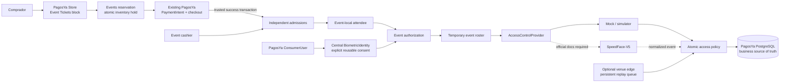

# paya

> This workspace extends the existing PagosYa commerce platform with a bounded **Events / Ticketing / Facial Access** module. PagosYa remains the online-payment and hosted-storefront source of truth; Events owns inventory, admissions, attendance, and access decisions.

Licensed under the GNU Affero General Public License v3.0 (`AGPL-3.0-only`).

## PagosYa Events MVP

Events is part of the existing PagosYa merchant experience—not a second product or payment stack. An organizer creates an event and ticket types, adds the native **Event Tickets** block to an existing PagosYa Store, sells through the incumbent `PaymentIntent` checkout, then manages cash sales, enrollment, access and capacity from the same merchant dashboard.



Key boundaries:

- Online money remains in PagosYa `PaymentIntent`, `Transaction`, ledger and webhook infrastructure. Events only references the successful payment.
- The buyer and attendee are independent. A three-ticket payment creates three admissions that can be claimed by three people.
- Payment, admission, assignment, biometric enrollment and presence have separate state machines.
- A customer may explicitly keep one reusable PagosYa Face Entry identity; each venue device receives only the temporary roster authorized for its active event.
- The terminal recognizes; PagosYa authorizes. PostgreSQL decides admission validity, capacity, presence and anti-passback atomically.
- No face model, image or template is implemented or logged. Application records contain consent and opaque provider/device references only.

### Run the Events demo locally

Node 20+, pnpm and PostgreSQL are required. The repository's embedded Postgres helper defaults to port `54329`.

```bash
pnpm install
pnpm dev:db
pnpm --filter @pagosya/api exec prisma migrate deploy
pnpm --filter @pagosya/api run prisma:generate
pnpm --filter @pagosya/api run seed

# Terminal 1 — PagosYa API and OpenAPI
PORT=3001 \
ZKTECO_INTEGRATION_MODE=mock \
EVENT_TOKEN_SECRET=replace-with-at-least-32-random-characters \
pnpm --filter @pagosya/api run start:dev

# Terminal 2 — hosted Store + existing checkout
VITE_API_BASE_URL=http://localhost:3001/v1 \
pnpm --filter @pagosya/checkout run dev -- --port 5175

# Terminal 3 — existing merchant dashboard
pnpm --filter @pagosya/merchant-dashboard run start
```

Open `http://localhost:4323`, set the API URL to `http://localhost:3001/v1` if needed, and sign in with one of the synthetic seed users:

| Role | User | Password |
|---|---|---|
| Organization admin | `admin@demo.pagosya.bo` | `PayaDemo!2026` |
| Event manager | `manager@demo.pagosya.bo` | `PayaDemo!2026` |
| Cashier | `cashier@demo.pagosya.bo` | `PayaDemo!2026` |
| Door staff | `doorstaff@demo.pagosya.bo` | `PayaDemo!2026` |
| Promoter | `promoter@demo.pagosya.bo` | `PayaDemo!2026` |

The seed creates **Noche Demo**, **Club Demo La Paz**, **Fiesta Demo** (capacity 900), General Bs 80, VIP Bs 150, a published `/s/noche-demo` Store with an Event Tickets block, staff memberships, a promoter allocation, simulated attendees and a bidirectional mock device. These credentials are development-only and the seed refuses production mode.

In the dashboard choose **Events**. The tabs provide event setup, cashier/POS, facial registration, door state, device simulator and immutable audit history. The simulator invokes the same normalized ingestion and access service used by a future hardware adapter.

To run the repeatable API/database acceptance flow:

```bash
API_BASE_URL=http://localhost:3001/v1 node scripts/verify-events-demo.mjs
API_BASE_URL=http://localhost:3001/v1 node scripts/verify-reusable-face-entry.mjs
```

The first script verifies a group cash sale, independent enrollment, entry, immediate anti-passback, exit, re-entry, two simultaneous readers, replay idempotency, Bs 240 reconciliation, online purchase through the existing PaymentIntent, three online admissions, invitation/claim, RBAC, privacy filtering and biometric deletion. The second verifies reusable consent, cross-event identity reuse without another scan, event roster removal, central Face Entry deletion, preserved financial/admission history, and event-only retention cleanup.

### Optional venue edge

`apps/edge` is a small executable Node process. It accepts only normalized device events, persists them to an owner-only local JSON queue, de-duplicates by `externalEventId`, retries with backoff, forwards an idempotency key, and reports queue lag.

```bash
pnpm --filter @pagosya/access-control run build
pnpm --filter @pagosya/edge run build

EDGE_PORT=3012 \
EDGE_QUEUE_FILE=./data/edge-device-events.json \
EDGE_CLOUD_EVENTS_URL=http://localhost:3001/v1/events/device-events \
EDGE_CLOUD_TOKEN=dash_or_dedicated_service_token \
EDGE_INGEST_TOKEN=local-lan-ingress-secret \
pnpm --filter @pagosya/edge run start

curl http://localhost:3012/health
```

Cloud authorization remains primary in this MVP. Provision a dedicated least-privilege edge identity and finish reviewed local roster/config caching before relying on offline authorization at a live venue.

### Events environment variables

| Variable | Purpose |
|---|---|
| `EVENT_TOKEN_SECRET` | HMAC key for management, claim and enrollment-token digests; required at 32+ characters in production. |
| `ZKTECO_INTEGRATION_MODE` | `mock` is functional; `push`/`sdk` intentionally fail closed pending official documentation. |
| `ZKTECO_DEVICE_HOST`, `ZKTECO_DEVICE_PORT` | Reserved real-adapter connection settings; unused by mock. |
| `ZKTECO_USERNAME`, `ZKTECO_PASSWORD` | Reserved vendor credentials; inject through secrets management and never commit. |
| `DEVICE_RAW_EVENT_RETENTION_HOURS` | Raw vendor payload retention policy; `0` by default. Normalized references are stored instead. |
| `EDGE_PORT`, `EDGE_QUEUE_FILE`, `EDGE_FLUSH_INTERVAL_MS` | Venue edge listener, persistent queue and retry cadence. |
| `EDGE_CLOUD_EVENTS_URL`, `EDGE_CLOUD_TOKEN` | Authenticated cloud ingestion target. |
| `EDGE_INGEST_TOKEN` | Optional bearer protection for local edge ingestion. |

See [`.env.example`](.env.example) for the full PagosYa configuration.

### Verification

```bash
pnpm --filter @pagosya/api run build
pnpm --filter @pagosya/api run test -- --runInBand src/events
pnpm --filter @pagosya/checkout run build
pnpm --filter @pagosya/access-control run test
pnpm --filter @pagosya/access-control run build
pnpm --filter @pagosya/edge run test
pnpm --filter @pagosya/edge run build
```

Current status and intentionally deferred scope are tracked in [`docs/IMPLEMENTATION_STATUS.md`](docs/IMPLEMENTATION_STATUS.md). The integration decision record is [`docs/EVENTS_INTEGRATION_PLAN.md`](docs/EVENTS_INTEGRATION_PLAN.md), and the reusable identity/device-cache design is documented in [`docs/FACE_ENTRY_ARCHITECTURE.md`](docs/FACE_ENTRY_ARCHITECTURE.md).

### SpeedFace-V5 and privacy limitation

The repository contains no official SpeedFace-V5 SDK, PUSH, ADMS or protocol documentation. `ZKTecoSpeedFaceProvider` therefore contains no network requests, invented commands or guessed payloads and fails closed. Supply documentation for the exact model, regional variant and firmware before real adapter work; the required evidence and network questions are enumerated in [`docs/ZKTECO_INTEGRATION.md`](docs/ZKTECO_INTEGRATION.md).

This implementation is privacy-by-design engineering, not a claim of legal compliance. Qualified Bolivian legal/privacy review is mandatory before launch. Review consent wording, retention, attendee rights, minors, vendor contracts, cross-border transfers and incident procedures in [`docs/PRIVACY_AND_COMPLIANCE.md`](docs/PRIVACY_AND_COMPLIANCE.md).

### Events production checklist

- Apply both Events migrations in staging, inspect legacy Event data, back up and test rollback/recovery.
- Use TLS, strong session/cookie settings, production CORS allow-lists, rate limits and a real secret/KMS envelope for device credentials.
- Replace demo users/passwords and provision least-privilege event and edge identities.
- Complete legal review, approved Spanish consent copy, privacy impact assessment and staff training.
- Add the scheduled retention/deletion worker, retries and deletion-failure alerts.
- Complete promoter management/reporting and Event refund/void operator endpoints.
- Load-test reservation expiry, high-rate door ingestion, capacity and multi-reader contention.
- Run browser accessibility/mobile smoke tests and hardware-in-the-loop tests.
- Do not enable `push` or `sdk` mode until the real adapter passes tests derived from official vendor documentation.

Developer integrations are documented in [`docs/DEVELOPER_API.md`](docs/DEVELOPER_API.md). Interactive OpenAPI is enabled by default only outside production; production requires the explicit `EXPOSE_API_DOCS=true` opt-in.

The current security controls, threat boundaries, and remaining real-money production blockers are tracked in [`docs/SECURITY_HARDENING.md`](docs/SECURITY_HARDENING.md).

Plataforma de pasarela de pagos boliviana, soluciones chatbots personalizados, pagos con tigo money, bancos, mastercard, criptomonedas, etc

## Modelo regulatorio

pagosYa opera bajo el régimen de **APP (Administradora de Pasarela de Pagos)**, no como ETF (Empresa de Tecnología Financiera). Esto significa que actuamos como pasarela de pagos sobre bancos, redes de tarjetas y Tigo Money ya regulados por ASFI — como Libélula — en lugar de sostener nuestra propia licencia financiera completa. Los rieles de pago (tarjetas, Tigo Money, transferencia bancaria, QR) se integran como adaptadores independientes de un banco/adquirente socio.

## Diferenciador: experiencia de integración

Libélula integra vía un manual PDF (v2.7.1, 2020) y plugins de e-commerce, sin documentación de API self-serve ni SDK oficial. pagosYa apuesta por una experiencia de integración moderna, al estilo Stripe:

- Llaves de API de prueba instantáneas
- Documentación interactiva (OpenAPI) generada desde el mismo código
- SDK oficial (`packages/sdk-node`)
- Widget de checkout embebible (`packages/widget-js`) en vez de solo plugins por plataforma

## Arquitectura

Monorepo (pnpm workspaces):

- `apps/api` — backend NestJS + TypeScript + PostgreSQL/Prisma. Núcleo del gateway: cuentas de comercio, `PaymentIntent` (máquina de estados), métodos de pago tokenizados, ledger de doble entrada, webhooks firmados (HMAC) con reintentos, claves de idempotencia, KYC/onboarding, Factura Electrónica (SIN) y payouts.
- `apps/checkout` — página de checkout (Vite + TS) servida en iframe desde el origen de pagosYa; es el único lugar donde los datos de pago tocan el DOM (reducción de alcance PCI estilo SAQ-A).
- `packages/widget-js` — script embebible (`pagosya.js`), análogo a Stripe.js, que monta el iframe de checkout y se comunica vía `postMessage`.
- `packages/sdk-node` — SDK tipado en TypeScript para el backend de los comercios.
- `packages/shared-types` — tipos compartidos entre api, checkout y widget.
- `apps/ops` — consola interna (HTML + JS sin build) para soporte de cuentas, revisión KYC, incidencias y auditoría. Cada agente se autentica con su propio token `ops_...` (ver Ops/auditoría abajo), no con un secreto compartido.
- `apps/merchant-dashboard` — dashboard de comercio (HTML + JS sin build): balance, pagos, payouts, estado de KYC/facturación. Login propio (email/contraseña, `MerchantUser`/`MerchantSession`) — la llave secreta nunca toca el navegador; se usa una sola vez, desde el backend del comercio, para crear el login (`POST /v1/dashboard/signup`).
- `apps/consumer-dashboard` — **Tiendas + Mi pagosYa** (HTML + JS sin build): abre primero el marketplace público de comercios registrados y muestra arriba el resumen de la cuenta opcional del comprador. La vista detallada reúne compras, entregas, pagos y obligaciones con múltiples comercios u organizaciones. Una conexión solo se propone cuando coinciden correo verificado y carnet normalizado con datos que la organización ya cargó; el usuario debe aceptarla antes de ver sus obligaciones.

### Cuenta del comprador y conexiones (`apps/api/src/consumer/`)

`ConsumerUser` es una identidad separada de `MerchantUser`: una persona puede comprar y mantener obligaciones con organizaciones no relacionadas entre sí. El alta confirma el correo y crea sesiones revocables `consumer_...`. El carnet se normaliza para la coincidencia y se devuelve enmascarado al panel. Las compras se vinculan por correo verificado; los pagos de obligaciones iniciados desde Mi pagosYa quedan vinculados explícitamente.

Una conexión no concede acceso por conocer un carnet. La oferta exige coincidencia previa de **correo + carnet** en una deuda importada por una tienda activa y aceptación del usuario. Después de aceptar, la persona puede consultar y pagar los registros de ese carnet, incluso si están agrupados bajo distintos nombres de beneficiarios o dependientes. `StoreOrder` conserva el detalle comprado y separa el estado de pago del estado de preparación/entrega; el comercio actualiza este último desde su panel.

### Onboarding, facturación y payouts

- **KYC** (`apps/api/src/merchants/kyc.service.ts`): un comercio nace en estado `PENDING`, envía sus datos (`POST /v1/merchants/kyc`) y pagosYa los aprueba/rechaza (`POST /v1/merchants/kyc/:id/review`). Solo al aprobar pasa a `ACTIVE` y puede pedir llaves `live` (`POST /v1/merchants/live_keys`).
- **Factura Electrónica** (`apps/api/src/invoicing/`): mismo patrón que los rieles de pago — un `InvoicingProvider` intercambiable y un worker asíncrono (outbox + reintentos). `SIAT_ENABLED=true` activa el adaptador SOAP v2 del piloto para comunicación, CUIS, CUFD y sincronización de catálogos con Token Delegado; el mock sigue siendo el valor por defecto. Los catálogos por contribuyente se exponen en `GET /v1/siat/catalogs/:catalog` (`activities`, `products`, `units`, `payment-methods`, `currencies`, `document-sectors`) y se almacenan durante 24 horas. El producto conserva por separado el SKU del comercio (`codigoProducto`) y la homologación SIN (`actividadEconomica`, `codigoProductoSin`, `unidadMedida`). La emisión fiscal real permanece bloqueada hasta implementar numeración fiscal estable, CUF y XML validado contra XSD; mientras tanto, el adaptador no encola facturas ni fabrica CUFs simulados.
- **Payouts** (`apps/api/src/payouts/`): un worker calcula el saldo no pagado de cada comercio `AGGREGATOR` (a partir del ledger) y lo transfiere vía un `PayoutProvider` (mock de un banco real). Los comercios `FACILITATOR` nunca se pagan aquí — sus asientos de `MERCHANT_PAYABLE` son solo informativos porque el riel ya liquidó directo a su cuenta.

### Ops y auditoría (`apps/api/src/ops/`)

Cada consulta o acción sensible de soporte y cada decisión KYC queda atribuida a una persona concreta, no a "quien tuviera el secreto compartido":

- `OpsUser` — credencial por persona (token `ops_...`, ver `OpsUserService`). `INTERNAL_OPS_SECRET` ya solo protege `POST /internal/ops_users` (crear/revocar revisores) — el día a día de revisión usa el token propio de cada revisor (`OpsAuthGuard`).
- `AuditLogEntry` — registro de cada decisión (actor, acción, objetivo, metadata), escrito en la misma transacción que el cambio que audita. Consultable en `GET /internal/audit_log`.
- `SupportCase` / `SupportCaseNote` — expediente interno asociado a un comercio, con tema, prioridad, responsable, notas y resolución. Abrir el dossier requiere `caseId`; los identificadores fiscales y bancarios se muestran enmascarados. Las acciones disponibles no exponen contraseñas ni tokens: envían recuperación de acceso o revocan sesiones y siempre exigen una razón.
- `pnpm run seed` crea un revisor demo (`ana@pagosya.bo`) e imprime su token la primera vez que corre.

Los comercios abren solicitudes desde el botón **Reportar un problema** de Yapi en `apps/merchant-dashboard`. `POST /v1/dashboard/support_cases` crea el caso con la sesión `dash_...`; `GET /v1/dashboard/support_cases` devuelve solo sus propios casos y la resolución pública, nunca notas internas. Yapi consulta el estado al refrescar el panel, al volver a la pestaña y cada 30 segundos mientras la página está visible. La secuencia mostrada es **Pendiente** (borrador local) → **Enviado** (la API recibió el caso) → **Revisado** (un agente abrió el expediente en Ops) → **Resuelto** (el agente registró la resolución).

### Login del dashboard de comercio (`apps/api/src/dashboard/`)

`MerchantAuthGuard` acepta llave secreta (`sk_...`) **o** token de sesión (`dash_...`) por prefijo, así que los endpoints de solo-lectura/configuración del comercio (`balance`, `payouts`, `payment_intents` list/get, `kyc`, `invoicing_profile`) funcionan igual desde un backend (llave secreta) o desde `apps/merchant-dashboard` (sesión). Los endpoints arbitrarios que mueven dinero (`POST /v1/payment_intents`, `confirm`, `refunds`) y `POST /v1/merchants/live_keys` exigen llave secreta explícitamente, nunca sesión. La única excepción acotada es `POST /v1/stores/:id/quick-qr-payments`: permite a un cajero autenticado iniciar un QR por un monto y concepto para una tienda activa propia, con límite de frecuencia, sin elegir otro riel, enviar metadata arbitraria, reembolsar ni emitir credenciales. Así el dashboard resuelve ventas presenciales sin exponer una llave secreta en el navegador.

`POST /v1/dashboard/signup` (con la llave secreta, desde el backend del comercio) crea el login; `POST /v1/dashboard/login` (público, email/contraseña) devuelve el token de sesión; `POST /v1/dashboard/logout` lo revoca.

`signup` siempre responde igual sin importar si el email ya está en uso — devolver una respuesta distinta sería un oráculo de existencia gratuito, dado que crear un comercio (`POST /v1/merchants`) es público y ya alcanza para llegar a `signup`. El email real solo queda confirmado (y el login habilitado) al usar el link de `GET /v1/dashboard/verify_email?token=...` (`EmailVerificationToken`, `EmailProvider`/`MockEmailProvider` — mismo patrón mock que los rieles/facturación/payouts). Un intento sin confirmar no bloquea el email para siempre: expira a las 24h y un `signup` posterior para ese email lo reemplaza.

### Rieles de pago (rails)

Cada riel (tarjeta, Tigo Money, transferencia bancaria, QR) implementa la misma interfaz `PaymentRailAdapter` (`authorize`, `capture`, `refund`, `getStatus`), resuelta en tiempo de ejecución por un `RailRegistry`. Mientras no existan credenciales reales de banco/adquirente/Tigo Money, cada riel corre contra un adaptador simulado (mock) con tokens de prueba deterministas — reemplazar un mock por una integración real implica escribir una nueva clase, sin tocar la lógica central.

### Flujo de pago

El comercio crea un `PaymentIntent` desde su backend con su llave secreta y entrega al navegador solo un `client_secret`. El widget monta un iframe de checkout que nunca expone datos sensibles ni la llave secreta al sitio del comercio. El `PaymentIntent` avanza por una máquina de estados (`requires_payment_method → requires_confirmation → processing → succeeded/failed/requires_action`) y cada cambio de estado exitoso genera asientos en el ledger de doble entrada y eventos de webhook, dentro de la misma transacción (patrón outbox).

### Rate limiting y observabilidad

`@nestjs/throttler` corre global (120 req/min/IP por defecto, con margen para la carga paralela del dashboard) con límites más estrictos (5-10 req/min) en los endpoints de auth: `POST /v1/merchants`, `/v1/dashboard/login`, `signup`, `verify_email`, `forgot_password`, `reset_password`. `GET /health` (chequeo de conectividad a la base) está exento — así un balanceador/orquestador puede pollearlo sin activar el límite. `AllExceptionsFilter` (global, en `main.ts`) loguea con stack trace cualquier excepción que no sea un `HttpException` bien formado, o que lo sea pero con status 5xx — sin eso, un error inesperado en cualquiera de los cuatro workers en background podía terminar siendo solo "un 500" sin nada en los logs que explique por qué.

## Cómo correrlo localmente

No requiere Docker: `apps/api` usa Postgres embebido (`embedded-postgres`) para desarrollo si no tienes Docker instalado; `docker-compose.yml` es la alternativa si sí lo tienes.

```bash
pnpm install
pnpm dev                                       # stack: API :3001, checkout :5175, comercio :4323, Mi pagosYa :4324 y ops :4322
pnpm dev:db                                    # levanta Postgres local (o: docker compose up -d)
pnpm --filter @pagosya/api exec prisma migrate deploy
pnpm --filter @pagosya/api run seed            # imprime llaves sk_test_/pk_test_ de prueba
pnpm --filter @pagosya/api run start:dev       # API en :3000, docs OpenAPI en /docs
pnpm --filter @pagosya/checkout run dev        # checkout iframe en :5173
pnpm --filter @pagosya/widget-js run build     # genera packages/widget-js/dist/pagosya.js

PAGOSYA_SECRET_KEY=sk_test_... pnpm --filter @pagosya/demo run start   # demo de comercio en :4321
pnpm --filter @pagosya/ops run start                                  # consola de ops en :4322
pnpm --filter @pagosya/merchant-dashboard run start                   # dashboard de comercio en :4323
pnpm --filter @pagosya/consumer-dashboard run start                   # Mi pagosYa en :4324
pnpm --filter @pagosya/checkout run build && pnpm --filter @pagosya/checkout run start # storefront app with /s/:slug routes
```

`apps/demo` es el ejemplo end-to-end: un servidor mínimo que hace de "backend del comercio" (usa `@pagosya/sdk-node` para crear el `PaymentIntent`) y sirve una página que monta el widget contra ese pago — el mismo camino que seguiría cualquier integrador real.

`apps/ops`, `apps/merchant-dashboard` y `apps/consumer-dashboard` llaman a la API directo desde el navegador. Los orígenes de checkout, comercio, ops y consumidor se configuran por separado; los adicionales siguen disponibles en `ADDITIONAL_CORS_ORIGINS` (ver `.env.example`).

### Dominios propios para tiendas

Cada tienda puede conectar hasta tres dominios desde **Apariencia → Publica con tu propio dominio**. La API guarda el hostname en `CustomDomain`, entrega un TXT único para probar propiedad y solo activa la resolución pública después de encontrar ese valor en DNS. Un dominio activo abre el storefront existente en `/`; sus productos usan `/p/:productId`, mientras los links históricos `/s/:slug` siguen funcionando.

En producción, `CUSTOM_DOMAIN_CNAME_TARGET` debe apuntar al hostname público del storefront. El proxy/CDN de ese hostname debe:

- aceptar y conservar el `Host` de dominios verificados;
- dirigirlos a `apps/checkout` (su servidor ya sirve `/` y `/p/:productId` para cualquier host);
- emitir y renovar certificados TLS para cada dominio conectado, por ejemplo mediante Cloudflare for SaaS o una capacidad equivalente del proveedor de hosting.

La aplicación resuelve el dominio, verifica propiedad y presenta los registros DNS. La emisión de TLS pertenece al edge de producción y no se puede completar solo desde el proceso Node local.
