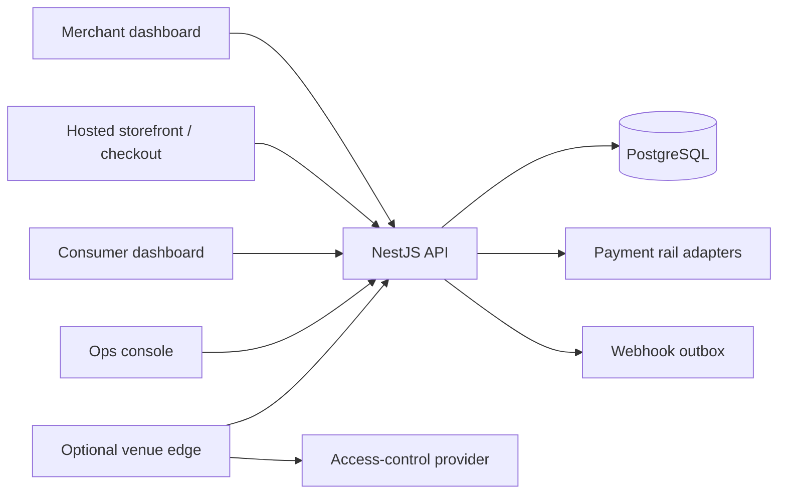
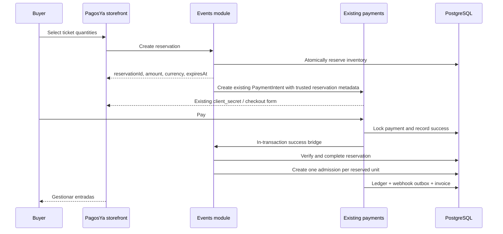

# PagosYa Events integration plan

Status date: 2026-08-27

## 1. Current PagosYa architecture

PagosYa is a TypeScript/pnpm modular monorepo. The production API is a NestJS modular monolith in `apps/api`, backed by PostgreSQL and Prisma. The public payment/storefront application in `apps/checkout` is Vite + TypeScript. The merchant, consumer, and operations dashboards are intentionally dependency-free HTML/CSS/JavaScript applications served by small Node servers. They are not React/Next applications and should not be rewritten as part of Events.

The repository already provides shared TypeScript contracts, an embeddable checkout widget, a Node SDK, a global validation pipe, Helmet, CORS allow-listing, throttling, Swagger/OpenAPI, idempotency middleware, structured exception handling, health checks, and an embedded-Postgres development path.

Logical deployment boundaries remain:

Events will be another bounded module in the API, not a separate account system or payment gateway. `packages/access-control` supplies a vendor-neutral hardware boundary. `apps/edge` supplies optional offline forwarding without changing cloud business rules.

## 2. Existing payment flow

`PaymentIntent` is the authoritative online-payment record. It moves through the existing state machine from `REQUIRES_PAYMENT_METHOD` through confirmation/processing to `SUCCEEDED`, `FAILED`, or `REQUIRES_ACTION`. A successful rail result is handled by `PaymentIntentsService.applyRailResult()` inside a Prisma transaction that:

1. locks the payment row;
2. records an immutable `Transaction`;
3. updates `PaymentIntent`;
4. posts double-entry ledger entries;
5. enqueues the signed `payment_intent.succeeded` outbox event;
6. queues invoicing and applies store inventory/order effects.

Events must hook into that same transaction. A reservation reference is placed in trusted `PaymentIntent.metadata`; on success the Events payment bridge verifies merchant, amount, currency, reservation state, and payment identity, then completes the reservation and creates admissions idempotently. Browser callbacks never create admissions.

## 3. Existing landing-page builder

PagosYa's no-code surface is the existing `Store` plus `StoreSiteDocument`. The merchant dashboard edits the document, `StoresService` validates/materializes it, and `apps/checkout` sanitizes and renders it. Sections currently include hero, story, catalog, gallery, contact, location, and links.

Events extends this document with an `event-tickets` section carrying only an event reference and presentation copy. Public event/ticket data is fetched from the Events API. The block creates a server-side inventory reservation, then opens the existing PagosYa payment form using the server-calculated amount. No second builder or checkout is introduced.

## 4. Existing authentication and merchant model

`Merchant` owns stores, payment intents, payment infrastructure, and merchant users. `MerchantUser` is a human dashboard identity; `MerchantSession` stores a hashed, expiring, revocable `dash_` token. `MerchantAuthGuard` accepts either a dashboard session or a secret API key, while money-moving generic payment endpoints remain restricted to stronger credentials.

Events belongs directly to `Merchant`. Existing merchant owners retain organization-level control. Event-scoped staff permissions are additive through `EventStaffMembership`; they do not replace PagosYa authentication. Server-side guards/services enforce role checks for `EVENT_MANAGER`, `CASHIER`, `DOOR_STAFF`, `PROMOTER`, and `AUDITOR`.

## 5. Existing relevant database models

Reused without duplication:

- `Merchant`, `MerchantUser`, and `MerchantSession` for ownership and login.
- `Store` and its site document for no-code event pages.
- `PaymentIntent` and `Transaction` for online payments.
- `WebhookEvent`/`WebhookEndpoint` for durable external payment notifications.
- `AuditLogEntry` for the existing operations audit trail; Events adds a merchant/event audit record because the existing table is intentionally ops-actor-shaped.
- `ConsumerUser` where an authenticated buyer already exists; attendance remains a separate purpose-limited identity.

Database inspection also found applied historical migrations for an earlier Events implementation even though its Prisma models were absent from the current source schema: `Event`, `EventPriceStage`, `EventOrder`, `EventSeat`, and `EventTicket`. The new module maps `TicketType`, `AdmissionOrder`, and `Admission` onto those physical tables with Prisma `@@map`/`@map`, retains legacy columns, and extends their enums in a separate committed migration. This prevents a second ticketing store and preserves existing production rows.

The existing `Transaction` cannot represent cash without a `PaymentIntent`, so Events adds the smallest necessary append-only `EventFinancialTransaction` and `CashShift` records. It does not create another online payment table.

## 6. Integration locations

- `apps/api/prisma/schema.prisma`: merchant-owned Events and Access entities and relations.
- `apps/api/src/events`: controllers, validation DTOs, RBAC, reservations, admissions, cash, enrollment, access decisions, reports, privacy deletion, and audit.
- `apps/api/src/payment-intents/payment-intents.service.ts`: one bounded success hook calling the Events payment bridge inside the existing transaction.
- `apps/api/src/stores/site-document.ts` and `apps/checkout/src/site-document.ts`: the `event-tickets` block contract.
- `apps/checkout`: event block rendering, reservation creation, and existing payment-form handoff.
- `apps/merchant-dashboard`: Events navigation and operational surfaces using the incumbent design system and session.
- `packages/access-control`: normalized provider contract, complete mock, and isolated SpeedFace skeleton.
- `apps/edge`: idempotent offline queue and cloud forwarding.

## 7. Existing code to reuse

- Prisma transaction and row-locking conventions from payment/inventory flows.
- `MerchantAuthGuard`, current-merchant decorators, dashboard sessions, Argon2 password hashing, API throttling, Swagger, and validation.
- `PaymentIntentsService`, rail registry, checkout client secret, hosted form, ledger, and payment outbox.
- Store/site-document validation and the existing public storefront.
- Existing BOB minor-unit representation (`amount` is integer cents/centavos) and currency validation.
- Existing upload, email, webhook, audit, health, configuration, and deployment mechanisms.
- Existing 0xProto Mono/business-bento visual system and Spanish product voice.

## 8. Extended and new models/modules

Legacy models extended in place: `Event`, `TicketType` → `EventPriceStage`, `AdmissionOrder` → `EventOrder`, `Admission` → `EventTicket`, and preserved `EventSeat`.

New commerce/access models: `Venue`, `TicketReservation`, `TicketReservationItem`, `AdmissionAssignment`, `Attendee`, `EnrollmentSession`, `BiometricIdentity`, `BiometricConsent`, `BiometricCredential`, `EventBiometricAuthorization`, `BiometricDeletionJob`, `AccessDevice`, `DevicePersonMapping`, `DeviceEventIngest`, `AccessEvent`, `AccessAttempt`, `CashShift`, `EventFinancialTransaction`, `EventRefund`, `EventStaffMembership`, `PromoterProfile`, `EventPromoterAllocation`, `GuestListEntry`, and `EventAuditLog`.

State remains orthogonal: payment state stays on PagosYa `PaymentIntent`; reservation, admission, assignment, enrollment, presence, consent, and device health use independent fields/enums.

## 9. Checkout to admission flow

Idempotency is enforced by unique reservation/payment relations plus conditional state transitions. Reservation expiry releases reserved inventory. Claim and management tokens are cryptographically random, stored only as hashes, short-lived/revocable, and single-use where appropriate.

## 10. ZKTeco integration boundary

Application services consume `NormalizedDeviceEvent` and `AccessControlProvider`, never ZKTeco payloads. The complete mock provider emits the same normalized events used by production ingestion. `ZKTecoSpeedFaceProvider` contains no network endpoint or payload assumption until official SpeedFace-V5 SDK/PUSH/ADMS documentation is supplied.

The platform database—not terminal memory—is authoritative for admission validity, payment policy, presence, capacity, anti-passback, consent, and deletion state. `ConsumerUser` owns an explicitly reusable `BiometricIdentity`; `Attendee` remains event-local; `EventBiometricAuthorization` connects identity, attendee, admission, and consent for one event. SpeedFace devices are event-specific cache targets, and device person IDs are event/device-scoped mappings. Raw templates/images are never part of normal application records or logs. The full decision is documented in `docs/FACE_ENTRY_ARCHITECTURE.md`.

No SpeedFace protocol documentation was found in the inspected PagosYa repository. The evidence required to implement the real adapter is tracked in `docs/ZKTECO_INTEGRATION.md`.
