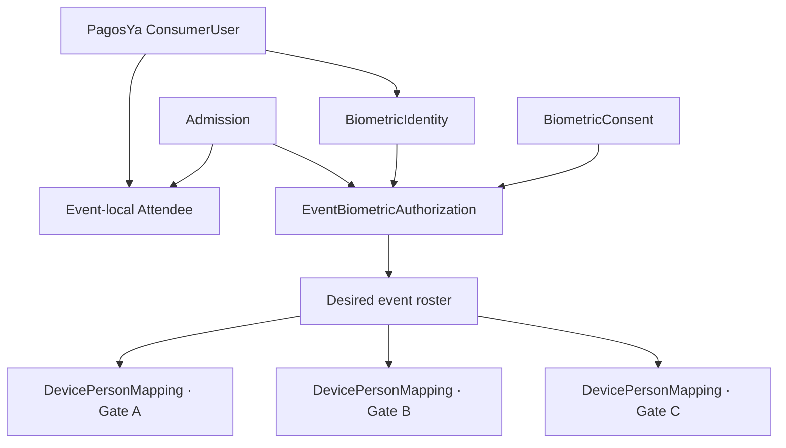
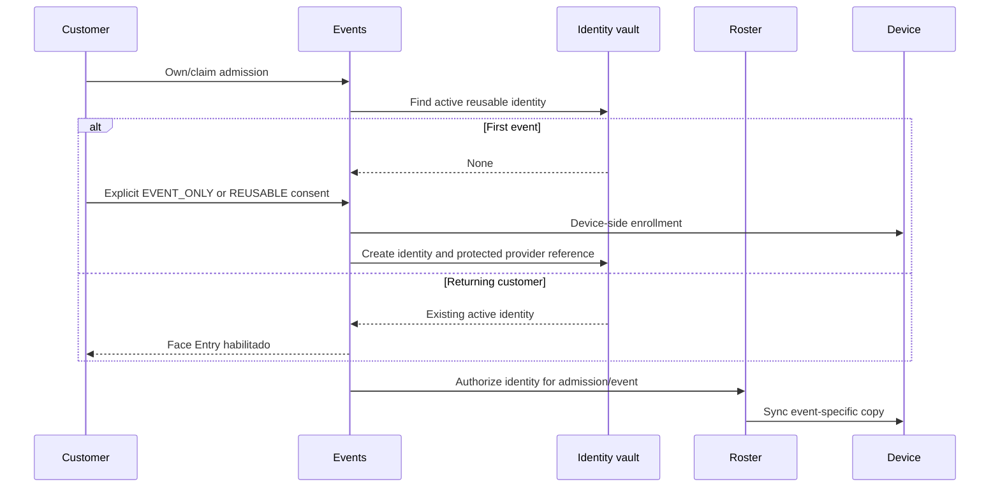

# Reusable PagosYa Face Entry architecture

Status: implemented for the mock provider. Real SpeedFace-V5 profile transport remains blocked pending official vendor documentation.

## Architectural decision

PagosYa `ConsumerUser` is the central customer identity. `Attendee` is an event-local projection, `BiometricIdentity` is a reusable or event-only biometric profile, and `EventBiometricAuthorization` binds one valid admission to one identity for one event. A physical terminal is an event-specific cache, never the permanent customer biometric repository.

Payments and admission history do not contain biometric material. Venue devices receive only profiles that currently satisfy the event authorization query.

## Identity and consent

`BiometricIdentity` stores provider type, lifecycle status, reusable-consent choice, compatibility metadata, opaque encrypted provider references, and verification timestamps. It does not assume a ZKTeco template format. Provider values are `MOCK`, `ZKTECO`, and `FUTURE_PROVIDER`; lifecycle values are `ACTIVE`, `REVOKED`, `DELETED`, and `REQUIRES_REENROLLMENT`.

Consent has two explicit scopes:

- `EVENT_ONLY`: retention ends according to the event policy. Event cleanup removes terminal copies and deletes the central identity when its retention deadline passes.
- `REUSABLE`: available only to an authenticated PagosYa `ConsumerUser`. Event cleanup removes terminal copies but retains the protected central identity until revocation, consent expiry, compatibility failure, or customer deletion.

Existing admission-bound credentials are migrated as `EVENT_ONLY`. The migration never silently opts a legacy customer into reusable Face Entry.

## First and returning event flows

The authenticated consumer endpoints are:

- `GET /v1/events/consumer/face-entry`
- `POST /v1/events/consumer/admissions/:admissionId/face-entry`
- `POST /v1/events/consumer/admissions/:admissionId/enrollment-session`
- `POST /v1/events/consumer/enrollment-sessions/:sessionId/complete`
- `DELETE /v1/events/consumer/face-entry`

An admission ownership token or an existing consumer-attendee binding is required before Face Entry can be attached. A public/staff-created enrollment session is event-only; reusable enrollment requires an authenticated consumer session.

## Event roster synchronization

`EventRosterService.syncEventRoster()` calculates the desired set from:

1. active or legacy-valid admission;
2. paid order;
3. admission enrollment state `ENROLLED`;
4. active `EventBiometricAuthorization`;
5. active `BiometricIdentity`;
6. non-revoked, non-expired consent.

It compares that set with current `DevicePersonMapping` rows and performs only required additions, updates, and removals. A SHA-256 content fingerprint prevents repeated uploads of unchanged profiles. Sync states are `PENDING`, `SYNCING`, `SYNCED`, `FAILED`, `REMOVAL_PENDING`, and `REMOVED`.

Each device mapping has its own opaque `externalPersonId`. The same central identity can therefore be `8291` on Gate A and `5512` on Gate B without assuming a global ZKTeco person identifier.

Configured `faceCapacity` is mandatory before sync. If the desired roster is larger than the configured capacity, the API returns `DEVICE_FACE_CAPACITY_EXCEEDED`; it never truncates the roster silently. `faceCapacity`, `algorithmVersion`, and `providerCapabilities` must be populated from confirmed hardware/firmware evidence in production.

Merchant operations endpoints are:

- `POST /v1/events/:eventId/devices/:deviceId/roster/sync`
- `POST /v1/events/:eventId/devices/:deviceId/roster/remove`
- `POST /v1/events/:eventId/end`
- `POST /v1/events/:eventId/biometrics/cleanup`

## Access decision

A recognition event resolves device plus external person ID to a central identity, then to the event-specific authorization and admission. Invalid identity, revoked/expired consent, removed mapping, wrong event, or missing authorization is denied before access policy evaluation. Entry and exit still use the serializable, row-locked admission state transition, so recognition at two gates cannot bypass anti-passback.

## Event end and deletion

Ending an event stops its active lifecycle and schedules cleanup. Cleanup removes the event roster from assigned devices and marks mappings `REMOVED`. Reusable identities remain central. Event-only identities are deleted after their retention deadline. A customer Face Entry deletion removes the identity from every active device, revokes authorizations and consents, clears protected provider references, and retains payments, admissions, access decisions, and minimal deletion audit evidence.

## Provider portability boundary

The provider receives an opaque `BiometricProfileReference`. After enrollment, a documented provider may return an opaque `providerExternalId`, `encryptedTemplateReference`, or `encryptedVendorPayload`; core Events stores these protected references but never parses or logs them. It never assumes that a SpeedFace-V5 profile can be exported or transferred. The real implementation may eventually use a portable vendor template, a secure enrollment artifact, vendor server identity, or an incompatibility result requiring re-enrollment. All four outcomes fit the current domain without changing ticketing or access authorization.
